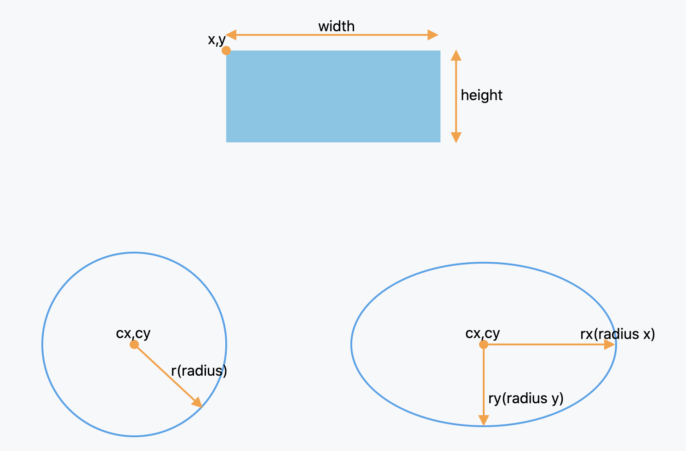
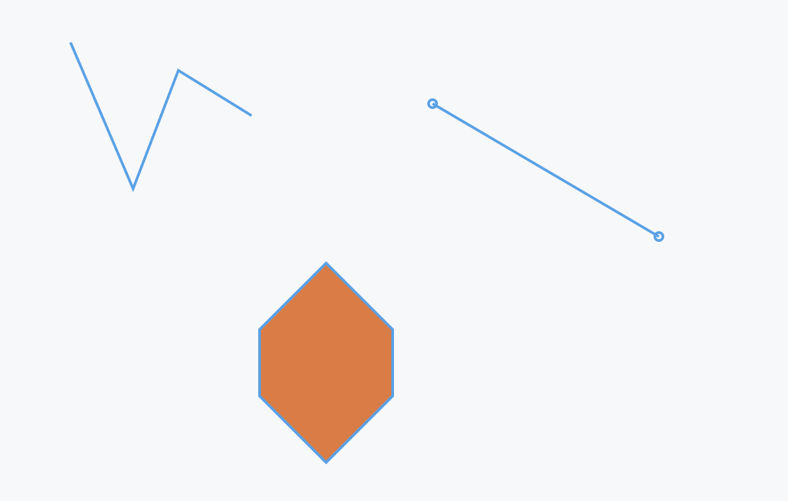
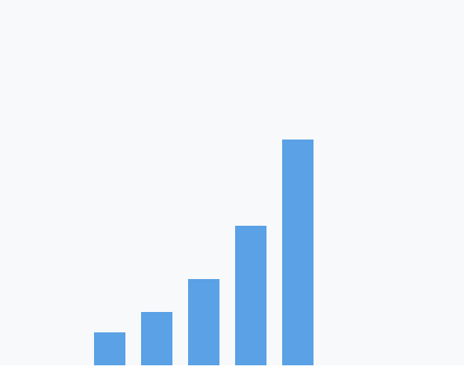
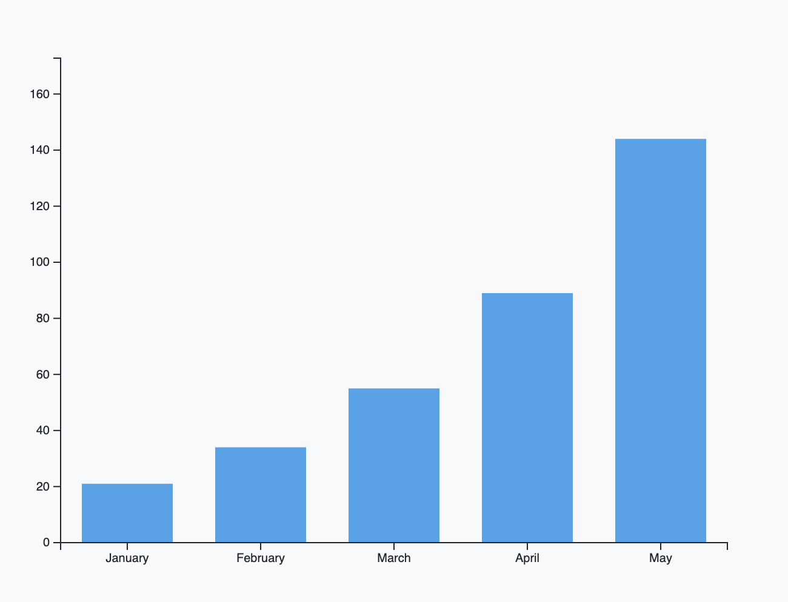
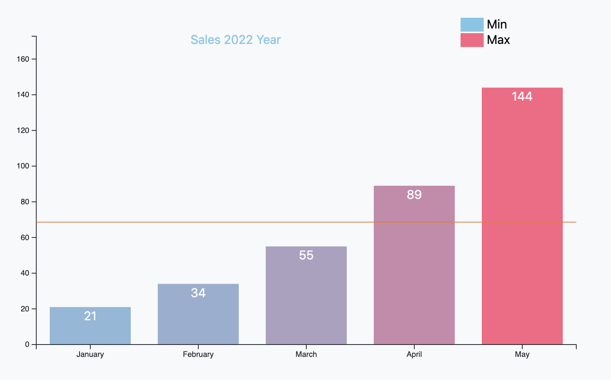
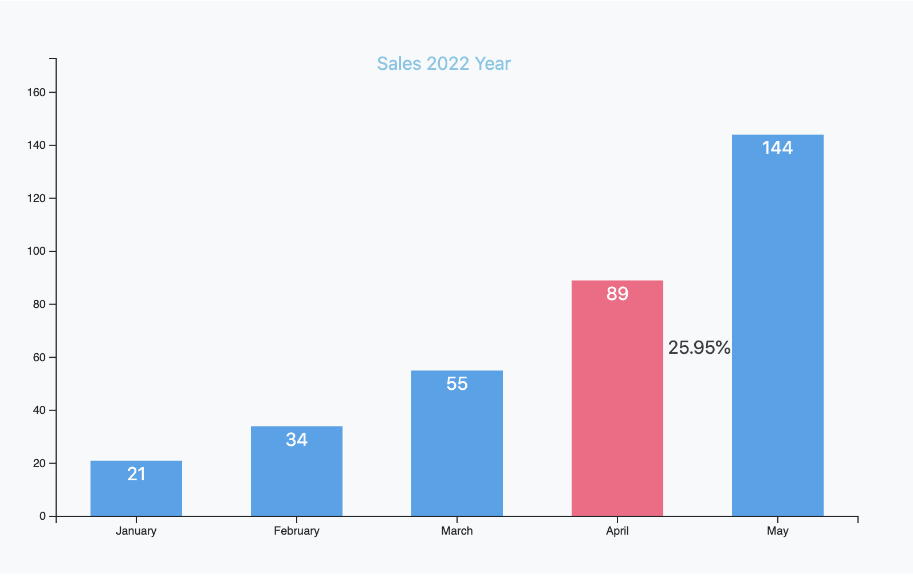
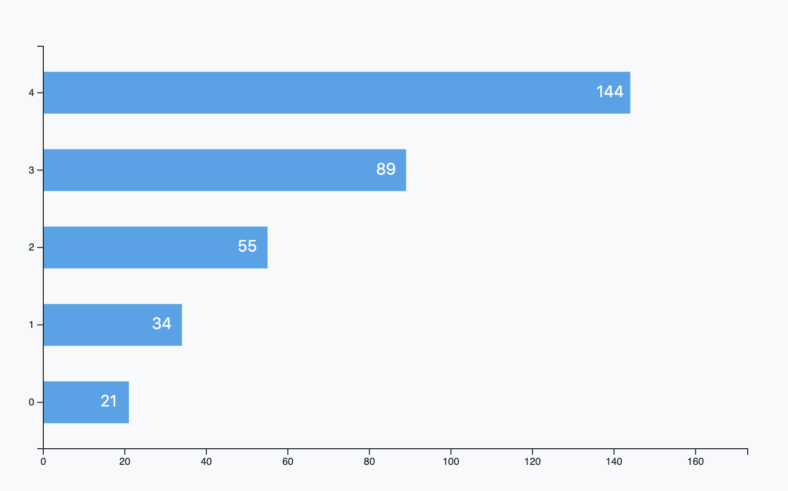

# This example is a quick exercise to create D3 charts.
The example is used D3.js v7.1.1.
Bootstrap version is 5.1.3.

# Example Reference

| No.  | Title | Description | 内容 | Thumbnail
| ------------- | ------------- | ------------- | ------------- |
| 001  | Selection  | Selecting Elements  | 选择器 | </img> |
| 002  | 7 Basic Elements 1 | Rect, Circle and Ellipse  | 矩形 圆形 椭圆 | </img> |
| 003  | 7 Basic Elements 2 | Line, Polyline and Polygon  | 线条 折线 多边形 | </img>  |
| 004  | 7 Basic Elements 3 | Path  | 路径 | </img>  |
| 005  | Simple Bar  |   | 简单柱状图  | </img>  |
| 006  | Bar Chart With Axis, Mean |  | 柱状图 坐标轴 比例尺 | </img>  |
| 007  | Bar Chart With Mouse Event  |  柱状图 鼠标悬浮事件 |   | </img>  |
| 008  | Vertical Bar Chart  |  横向条形图  |   | </img>  |
| 009  | Liner  |   |  | </img>  |

