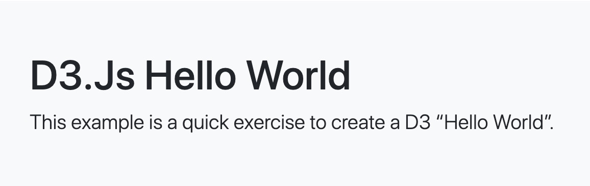

# This example is a quick exercise to create D3 charts.
The example is used D3.js v7.1.1.
Bootstrap version is 5.1.3.

# Example Reference

| No.  | Title | Description | Thumbnail
| ------------- | ------------- | ------------- | ------------- |
| 001  | Selection  | Selecting Elements  | </img>  |
| 002  | 7 Basic Elements | Rect, Circle and Ellipse  | </img> |
| 003  | 7 Basic Elements  | Line, Polyline and Polygon  | </img>  |
| 004  | Simple Bar  | Path  | </img>  |
| 005  | Bar Chart  |   | </img>  |
| 006  | Bar Chart With Axis, Mean |   | </img>  |
| 007  | Bar Chart With Mouse Event  |   | </img>  |
| 008  | Vertical Bar Chart  |   | </img>  |
| 009  | Liner  |   | </img>  |

