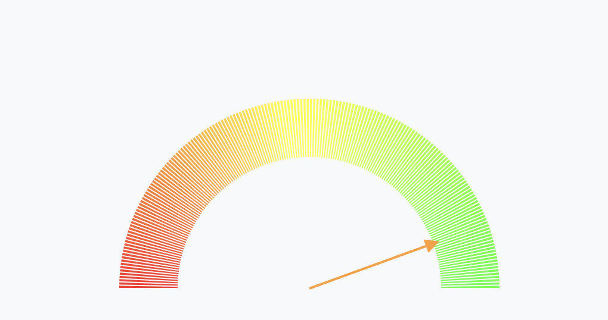

# This example is a quick exercise to create D3 charts.
The example is used D3.js v7.1.1.

# Example Reference

| No. | Title | Description | 内容 | Thumbnail |
| ------------- | ------------- | ------------- | ------------- | ------------- |
| 001  | Selection  | Selecting Elements  | 选择器 | </img> |
| 002  | 7 Basic Elements 1 | Rect, Circle and Ellipse  | 矩形 圆形 椭圆 | </img> |
| 003  | 7 Basic Elements 2 | Line, Polyline and Polygon  | 线条 折线 多边形 | </img>  |
| 004  | 7 Basic Elements 3 | Path  | 路径 | </img>  |
| 005  | Simple Bar  |   | 简单柱状图  | </img>  |
| 006  | Bar Chart With Axis, Scale |  | 柱状图 坐标轴 比例尺 | </img>  |
| 007  | Bar Chart With Legend | Color Column Bar | 柱状图 图例 均线 | </img>  |
| 008  | Bar Chart With Mouse Event |   | 柱状图 鼠标悬浮事件 | </img>  |
| 009  | Vertical Bar Chart  |  | 横向条形图  | </img>  |
| 010  | Scatter Chart  |  | 散点图  | </img>  |
| 011  | Line Chart  |  | 折线图  | </img>  |
| 012  | Area Chart  |  | 面积图  | </img>  |
| 013  | Arc Shape  |  | 饼图  | </img>  |
| 014  | Pie Chart  |  | 饼图  | </img>  |
| 015  | Doughnut Chart |  | 环形图  | </img>  |
| 016  | Gauge Chart |  | 仪表图 测量图  | </img>  |
| 017  | Time Series Line |  | 时间序列图  | </img>  |
| 086  | Word Cloud |  | 词云图  | </img>  |

